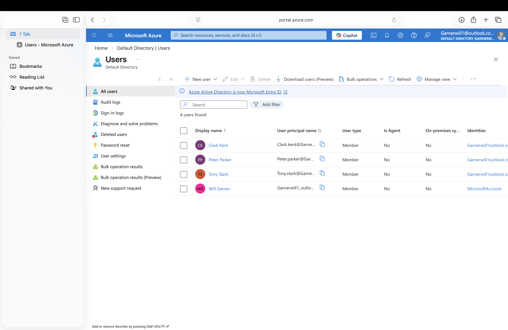
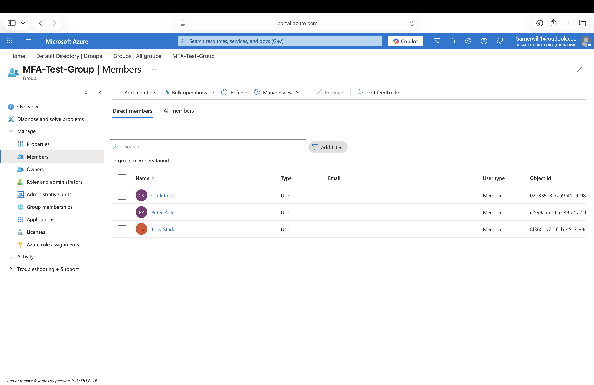
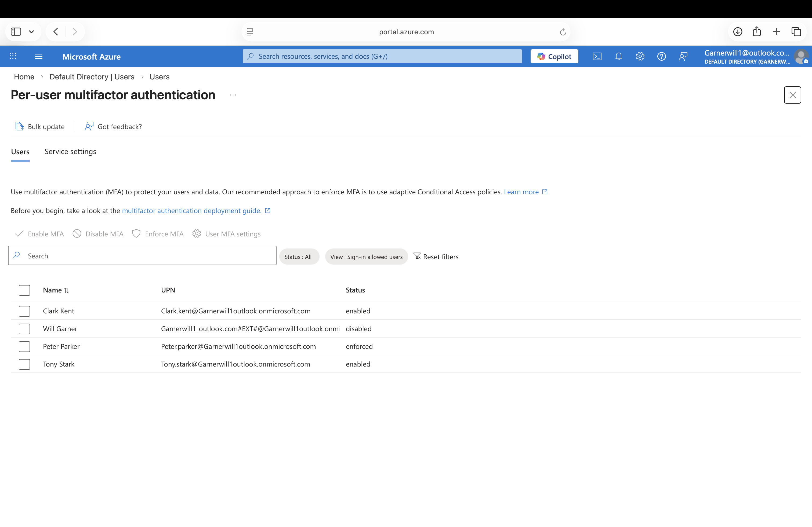
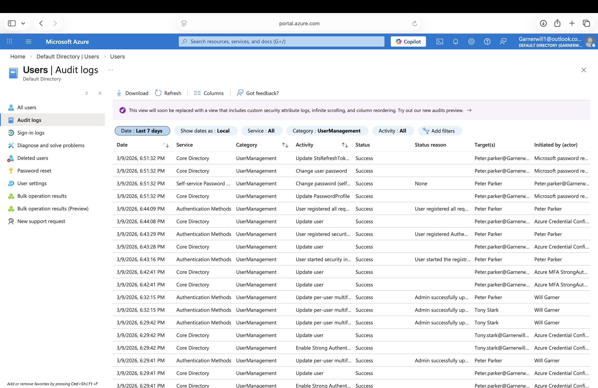

# Microsoft Entra IAM Lab

## Overview
This project is a beginner Identity and Access Management (IAM) home lab built in Microsoft Entra ID. The goal was to practice core IAM tasks such as user provisioning, group-based administration, multifactor authentication, and audit log review.

## Objectives
- Create cloud user accounts in Microsoft Entra ID
- Create and manage a security group
- Add users to the group
- Enable MFA for test users
- Register Microsoft Authenticator for a test account
- Review audit logs to validate administrative and authentication activity

## Lab Environment
- Microsoft Entra ID
- Microsoft Authenticator
- GitHub for documentation

## Users Created
- Peter Parker
- Tony Stark
- Clark Kent

## Tasks Performed
1. Created three test users in Microsoft Entra ID
2. Created a security group named `MFA-Test-Group`
3. Added all three users to the security group
4. Enabled per-user MFA for the test accounts
5. Registered Microsoft Authenticator for a test user
6. Reviewed audit logs for identity and security events

## Results
- Successfully provisioned cloud identities
- Practiced group-based user administration
- Enabled MFA for multiple users
- Configured Microsoft Authenticator for a test account
- Verified administrative and authentication-related actions through audit logs

## Skills Demonstrated
- Identity and access management
- User provisioning
- Group management
- Multifactor authentication
- Authentication method registration
- Audit log review
- Microsoft Entra administration

## Screenshots

### 1. User Provisioning in Microsoft Entra ID

### 2. Security Group Membership

### 3. Per-User MFA Enabled

### 4. Microsoft Authenticator Registration

### 5. Audit Log Review

## What I Learned
This lab helped me understand how IAM administrators create and manage identities, apply MFA to user accounts, and validate actions through audit logs in Microsoft Entra ID.

## Resume Bullet
Built a Microsoft Entra IAM home lab by provisioning cloud users, creating a security group, enabling MFA for test accounts, registering Microsoft Authenticator, and reviewing audit logs to validate identity-related events.
